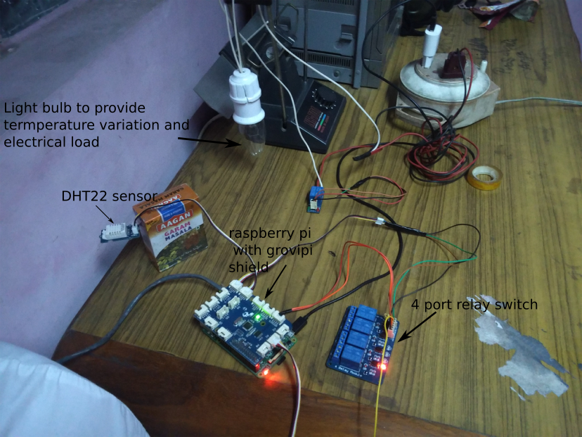

# bhakari-pi
Bhakari-pi is an extreme affordability circuit designed to monitor temperature and humidity in storage of grains using the raspberry pi. It uses DHT22 (temperature/humidity sensor) and based on criteria defined here (http://www.kcomfg.com/_docs/PDFs/Rice_Storage.pdf) switches ON relays that can turn on fans or other areation units.

The code consist of one that gathers data from sensor and switches On or OFF the relay switch and another that shows a running graph through a web framework. Both of these are written using Python 2.7

**Components required :**
- Raspberry pi (this is tested on version 2)
- Grovepi breakout board (to make connections easier)
- DHT22 (temperature / humidity) sensor
- Relay switch (optional)
- Power Source

The circuit design adn youtube video of the experiment as given below:

**Pre-reqs :**
- Rasbian is preloaded and working
- Download https://github.com/DexterInd/GrovePi and check to see DHT22 sensor is working with the code inside the software/Python folder
- Install influxdb (https://www.influxdata.com/downloads/#influxdb -- install the linux armh binary)
- Install influxdb-python (https://github.com/influxdata/influxdb-python)

**Getting Started Usage :**
- To Collect data -- python dataRetriever.py
- To See timeseries graph -- python piDataViz.py

